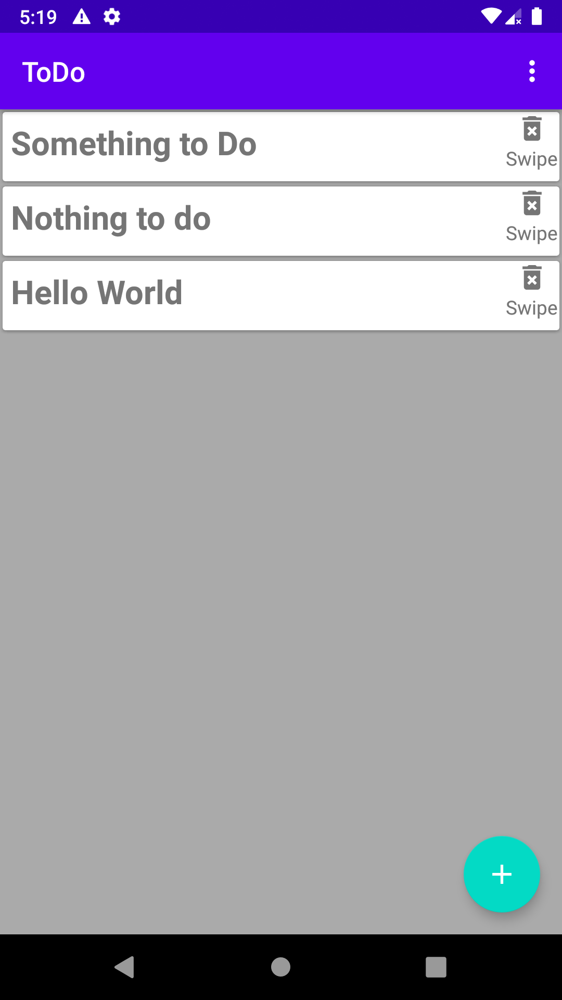
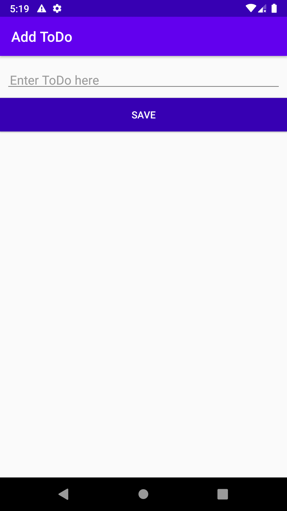
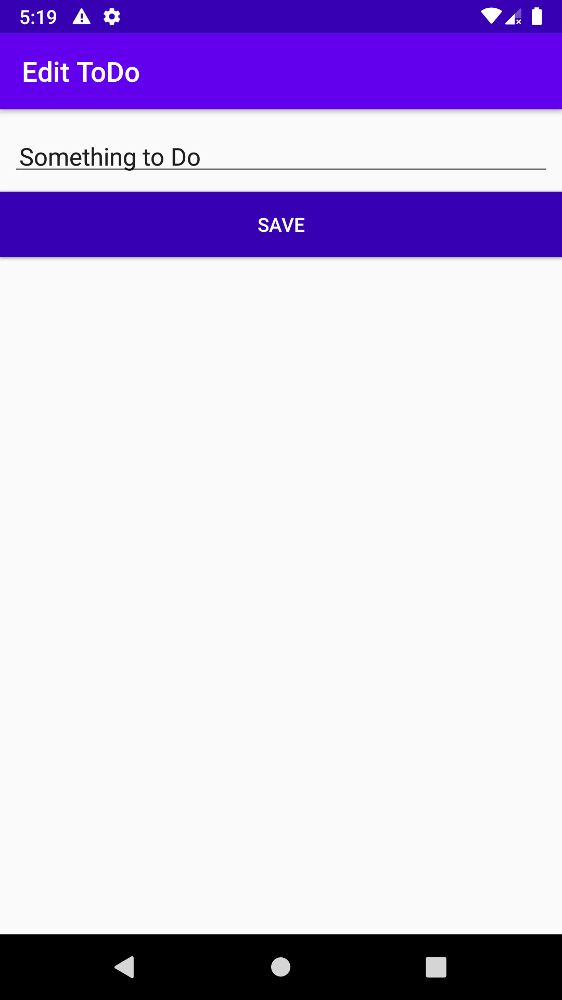

# ToDoApp
## This is a simple ToDo list app using ROOM database.

This app uses MVVM architectural pattern to separate the UI and backend-logic code with ROOM database. The app can add ToDo text, edit and 
swipe to delete the item and a menu dropdown which is used to delete all the data at once.

................
